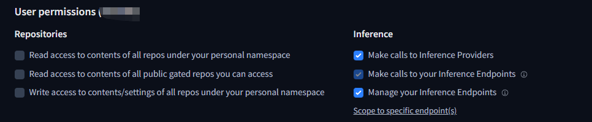
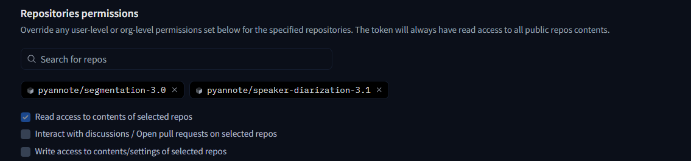

# TransVox

> **AI Video Translation with Voice Cloning | AI 视频翻译与语音克隆**

TransVox 是一款强大的 AI 驱动视频翻译配音工具，能够自动将视频翻译为目标语言并生成配音，同时保留原说话人的音色特征。基于 WhisperX、GPT-SoVITS、IndexTTS 等先进的开源 AI 模型构建，提供从视频到配音的完整自动化流程。

**核心能力：** 一键实现多语言视频本地化，Zero-Shot TTS 技术克隆原声，无需训练即可生成自然流畅的配音。

[](LICENSE)
[](https://www.python.org/)
[](https://github.com/a-cold-bird/TransVox)

## ✨ 核心特性

-  **全自动流程** - 一键完成从视频到配音的全流程处理
-  **AI 语音克隆** - 使用 Zero-Shot TTS 保留原说话人音色
-  **多语言支持** - 支持中英日韩互译（IndexTTS: 中英，GPT-SoVITS: 中英日韩）
-  **说话人识别** - 自动识别并标注不同说话人（基于 whisperx和pyannote）
-  **人声分离** - 高质量分离人声和背景音（MSST-WebUI）
-  **智能字幕** - Gemini/OpenAI AI 智能分行，双语字幕支持
-  **字幕渲染** - 使用霞鹜文楷开源字体，美观易读
-  **GPU 加速** - 支持 CUDA 12.8，充分利用 GPU 性能
-  **开箱即用** - 提供模型下载、环境检测、API 测试等辅助工具
-  **灵活配置** - 支持多种 TTS 引擎、转录引擎，可自定义模型

## 🎬 效果展示

### 英文 → 中文配音（主要示例）

<table>
<tr>
<td width="50%">

**🎬 原视频（英文）**

*Renaissance 历史课，英文讲解*

<video src="https://github.com/a-cold-bird/TransVox/raw/main/assets/videos/demo_en_source.mp4" width="100%" controls></video>

[下载](assets/videos/demo_en_source.mp4) | [ B站观看](https://www.bilibili.com/video/BV17z411b72M/)

时长：6分35秒 | 大小：20MB

</td>
<td width="50%">

**🎙️ 中文配音（AI 生成）**

*IndexTTS 克隆原音色*

<video src="https://github.com/a-cold-bird/TransVox/raw/main/assets/videos/en_to_zh.mp4" width="100%" controls></video>

[下载](assets/videos/en_to_zh.mp4) | 时长：6分35秒 | 大小：23MB

</td>
</tr>
</table>

### 更多语言配音效果

<table>
<tr>
<th width="50%">🇯🇵 日文配音</th>
<th width="50%">🇰🇷 韩文配音</th>
</tr>
<tr>
<td align="center">

**GPT-SoVITS 生成**

<video src="https://github.com/a-cold-bird/TransVox/raw/main/assets/videos/demo_en_to_ja.mp4" width="100%" controls></video>


[下载](assets/videos/demo_en_to_ja.mp4) | 23MB

</td>
<td align="center">

**GPT-SoVITS 生成**

<video src="https://github.com/a-cold-bird/TransVox/raw/main/assets/videos/demo_en_to_ko.mp4" width="100%" controls></video>


[下载](assets/videos/demo_en_to_ko.mp4) | 23MB

</td>
</tr>
</table>

> 💡 **演示特点**：
> - ✅ 完整保留原说话人音色和语调
> - ✅ 自动说话人识别（多人对话场景）
> - ✅ 背景音乐保留并混音
> - ✅ 时间轴自动对齐  

---

## 📋 目录

- [环境要求](#环境要求)
- [安装步骤](#一安装步骤)
- [API 配置](#二必要的-api-key-与-token-配置)
- [快速开始](#四快速开始)
- [使用方法](#五使用方法)
- [注意事项](#六使用注意事项与建议)
- [常见问题](#七常见问题)
- [致谢](#八依赖项目与致谢)

---

## 环境要求

- NVIDIA GPU（推荐 2080Ti 及以上）
- Python 3.10（推荐）
- ffmpeg 已安装并可在 PATH 中使用

## 一、安装步骤

### 1. 安装 Python 依赖

**Windows：**

```powershell
python -m venv venv
venv\Scripts\activate
python -m pip install --upgrade pip

# 安装 PyTorch（CUDA 12.8）
pip3 install torch torchvision --index-url https://download.pytorch.org/whl/cu128

# 安装项目依赖
pip install -r requirements.txt

# 安装 IndexTTS
pip install -e tools/index-tts

# 下载 NLTK 数据（GPT-SoVITS 英文处理需要）
python download_nltk_data.py

# 安装 ffmpeg（若未安装）
# scoop install ffmpeg   或   choco install ffmpeg
```

**Linux：**

```bash
python3 -m venv venv
source venv/bin/activate
pip install --upgrade pip

# 安装 PyTorch（CUDA）
pip3 install torch torchvision

# 安装项目依赖
pip install -r requirements.txt

# 安装 IndexTTS
pip install -e tools/index-tts

# 下载 NLTK 数据（GPT-SoVITS 英文处理需要，（也许需要挂代理））
python download_nltk_data.py

# 安装 ffmpeg（若未安装）
sudo apt-get update && sudo apt-get install -y ffmpeg
```

### 2. 下载必需模型

运行自动下载脚本（推荐）：

```powershell
python download_models.py
```

脚本会自动下载以下模型：
- MSST-WebUI 人声分离模型
- GPT-SoVITS 预训练模型
- IndexTTS-2 预训练模型

> 💡 国内用户加速：在 `.env` 中添加 `HF_ENDPOINT=https://hf-mirror.com` 使用镜像站

### 3. 检查环境配置（推荐）

完成上述步骤后，运行环境检测脚本验证所有组件是否就绪：

```powershell
python check_environment.py
```

脚本会检查：
- GPU 和 CUDA 是否可用
- ffmpeg 是否安装
- Python 依赖是否完整
- MSST/GPT-SoVITS/IndexTTS 模型是否下载
- 环境变量是否配置

**手动下载（可选）：**

如果自动下载失败，可手动下载并放置到对应目录：

<details>
<summary>点击展开手动下载说明</summary>

**MSST-WebUI 模型：**
- [model_mel_band_roformer_karaoke_aufr33_viperx_sdr_10.1956.ckpt](https://hf-mirror.com/Sucial/MSST-WebUI/resolve/main/All_Models/vocal_models/model_mel_band_roformer_karaoke_aufr33_viperx_sdr_10.1956.ckpt)  
  → `tools/MSST-WebUI/pretrain/vocal_models/`
- [big_beta5e.ckpt](https://hf-mirror.com/Sucial/MSST-WebUI/resolve/main/All_Models/vocal_models/big_beta5e.ckpt)  
  → `tools/MSST-WebUI/pretrain/vocal_models/`
- [dereverb_mel_band_roformer_less_aggressive_anvuew_sdr_18.8050.ckpt](https://hf-mirror.com/Sucial/MSST-WebUI/resolve/main/All_Models/single_stem_models/dereverb_mel_band_roformer_less_aggressive_anvuew_sdr_18.8050.ckpt)  
  → `tools/MSST-WebUI/pretrain/single_stem_models/`

**GPT-SoVITS 模型** → `tools/GPT-SoVITS/GPT_SoVITS/`
```bash
huggingface-cli download lj1995/GPT-SoVITS --local-dir tools/GPT-SoVITS/GPT_SoVITS
```

**IndexTTS 模型** → `tools/index-tts/checkpoints/`
```bash
huggingface-cli download IndexTeam/IndexTTS-2 --local-dir tools/index-tts/checkpoints
```

</details>

---

## 二、必要的 API Key 与 Token 配置

### 1) 准备 Gemini API Key（用于字幕翻译）

1. 访问 [Google AI Studio](https://aistudio.google.com/) 创建 Gemini API Key
2. 将 Key 写入本地环境变量或项目根目录 `.env` 文件：
   - Windows PowerShell: `setx GEMINI_API_KEY "<your_key>"`
   - `.env` 文件中新增：`GEMINI_API_KEY=<your_key>`
3. （可选）配置 Gemini 模型版本：
   - 默认使用 `gemini-2.5-pro`
   - 如需更改，在 `.env` 中添加：`TRANSLATION_MODEL=gemini-2.0-flash`（或其他支持的模型）

> 注：流水线会自动加载根目录 `.env` 文件（如存在）

### 2) 准备 Hugging Face Token（用于说话人识别）

1. 登录 [Hugging Face](https://huggingface.co/)，进入 Settings → Access Tokens，新建 Token
2. 在 Token 权限设置中勾选 **"Read access to contents of selected repos"**
3. 选择以下两个仓库并同意使用条款：
   - [`pyannote/speaker-diarization-3.1`](https://huggingface.co/pyannote/speaker-diarization-3.1)
   - [`pyannote/segmentation-3.0`](https://huggingface.co/pyannote/segmentation-3.0)
4. 将 Token 写入 `.env` 文件：
   - `.env` 文件：`HUGGINGFACE_TOKEN=<your_token>`

**配置参考：**

 


---

## 三、配置 GPT-SoVITS 模型（可选）

使用 GPT-SoVITS 本地模式（`--mode local`），可以自定义使用的模型权重。

### 模型配置文件位置

`tools/GPT-SoVITS/GPT_SoVITS/configs/tts_infer.yaml`

### 配置说明

配置文件包含多个预设版本（`custom`, `v1`, `v2`, `v2Pro`, `v2ProPlus`, `v3`, `v4`），默认使用 `custom` 配置。

**关键参数：**

```yaml
custom:
  bert_base_path: GPT_SoVITS/pretrained_models/chinese-roberta-wwm-ext-large
  cnhuhbert_base_path: GPT_SoVITS/pretrained_models/chinese-hubert-base
  device: cuda              # 设备：cuda 或 cpu
  is_half: true             # 是否使用半精度（FP16），显存不足时设为 true
  t2s_weights_path: GPT_SoVITS/pretrained_models/s1v3.ckpt  # GPT 模型权重
  version: v2Pro            # 模型版本
  vits_weights_path: GPT_SoVITS/pretrained_models/v2Pro/s2Gv2Pro.pth  # SoVITS 模型权重
```

### 如何使用自己训练的模型

1. **训练模型：** 使用 GPT-SoVITS WebUI 训练自己的模型，训练完成后模型保存在：
   - GPT 模型：`tools/GPT-SoVITS/GPT_weights/` 或 `GPT_weights_v2/`（根据版本）
   - SoVITS 模型：`tools/GPT-SoVITS/SoVITS_weights/` 或 `SoVITS_weights_v2/`（根据版本）

2. **修改配置文件：** 编辑 `tts_infer.yaml` 中的 `custom` 部分，指定你的模型路径：

```yaml
custom:
  bert_base_path: GPT_SoVITS/pretrained_models/chinese-roberta-wwm-ext-large
  cnhuhbert_base_path: GPT_SoVITS/pretrained_models/chinese-hubert-base
  device: cuda
  is_half: true
  t2s_weights_path: GPT_weights_v2/your_gpt_model.ckpt       # 修改为你的 GPT 模型
  version: v2Pro
  vits_weights_path: SoVITS_weights_v2/your_sovits_model.pth # 修改为你的 SoVITS 模型
```

3. **运行pipline：** 即可调用你的自定义模型：

```powershell
python stepB_gptsovits_pipeline.py <stem> --mode local --text_lang zh --prompt_lang en
```

**注意：**
- 路径相对于 `tools/GPT-SoVITS/` 目录
- `version` 参数需与模型版本匹配（v1/v2/v2Pro/v2ProPlus/v3/v4）

---

## 四、快速开始

### 下载视频（可选）

如需从网络下载视频，双击运行 `download_video.bat`：

```powershell
# 或手动运行
python -m yt_dlp -o "input/%(title)s.%(ext)s" -f "bv*[ext=mp4]+ba/b" "视频链接"
```

支持 YouTube、Bilibili、抖音等 1000+ 网站，自动下载到 `input/` 目录。

---

## 五、使用方法

### 方式一：全自动一键处理（推荐）

`full_auto_pipeline.py` 会自动运行音视频分离、人声分离、转录、翻译、TTS 合成、重新拼接等全流程。

**基本用法：**

```powershell
python full_auto_pipeline.py input/your_video.mp4 --target_lang zh
```

**常用参数：**

- `--target_lang {zh|en|ja|ko}`：目标翻译语言（**必填**）
- `--tts_engine {indextts|gptsovits}`：TTS 引擎（默认 indextts）
- `--tts_mode {local|api}`：GPT-SoVITS 运行模式（默认 local，失败后自动尝试 api）
- `--no-diarization`：禁用说话人识别（加快速度）
- `--no-separation`：禁用人声分离（加快速度）
- `--translation_mode {whole|smart}`：翻译模式（默认 whole）
- `--embed-subtitle`：自动嵌入字幕到最终视频（默认：不嵌入）
- `--subtitle-bilingual`：使用双语字幕（需配合 --embed-subtitle）

**示例：**

```powershell
# 英文视频翻译为中文（IndexTTS）
python full_auto_pipeline.py input/EN_test.mp4 --target_lang zh

# 中文视频翻译为英文（IndexTTS）
python full_auto_pipeline.py input/ZH_test.mp4 --target_lang en

# 使用 GPT-SoVITS（支持中日英韩，本地优先）
python full_auto_pipeline.py input/video.mp4 --target_lang ja --tts_engine gptsovits


# 加快速度：关闭人声分离和说话人识别
python full_auto_pipeline.py input/video.mp4 --target_lang zh --no-diarization --no-separation

# 自动嵌入字幕（单语）
python full_auto_pipeline.py input/video.mp4 --target_lang zh --embed-subtitle

# 自动嵌入双语字幕
python full_auto_pipeline.py input/video.mp4 --target_lang zh --embed-subtitle --subtitle-bilingual
```

**输出位置：**
- 配音视频：`output/<视频名>/merge/<视频名>_dubbed.mp4`
- 带字幕视频：`output/<视频名>/merge/<视频名>_dubbed_subtitled.mp4`（如启用 --embed-subtitle）

---

### 方式二：按步骤执行（适合手动修改字幕）

如需更细粒度控制流程（如手动修改字幕），可分步执行：

#### 步骤 1：预处理与转录

```powershell
python stepA_prepare_and_blank_srt.py input/your_video.mp4 -e whisperx -l auto
```

- 输出：`output/<stem>/<stem>.srt` 原始字幕文件

#### 步骤 2：翻译字幕

```powershell
python Scripts/step4_translate_srt.py output/<stem>/<stem>.srt --target_lang zh --whole_file
```

- 需要配置 Gemini API Key（或 OpenAI API Key，未充分测试）
- 输出：`output/<stem>/<stem>.translated.srt` 翻译后的字幕

**可选方案：使用免费在线翻译工具**

如果不想配置 API Key，可使用免费在线字幕翻译工具：[字幕翻译工具](https://tools.newzone.top/zh/subtitle-translator)（支持 SRT、ASS、VTT、LRC 格式，所有数据仅保存在本地浏览器）

> 此时可手动编辑 `.srt` 字幕文件以修正翻译内容

#### 步骤 3：语音合成

选择以下 TTS 引擎之一：

**IndexTTS（仅支持中英文）：**

```powershell
python stepB_index_pipeline.py <stem>
```

**GPT-SoVITS（支持中日英韩）：**

```powershell
python stepB_gptsovits_pipeline.py <stem> --mode local --text_lang zh --prompt_lang zh
```

**参数说明：**

- `<stem>`：视频文件基名（去扩展名），例如 `input/EN_test.mp4` 的 `<stem>` 为 `EN_test`
- `--text_lang {zh|en|ja|ko|auto}`：目标翻译语言（TTS 合成语言，仅 GPT-SoVITS 需要）
  - **IndexTTS 会自动从翻译文本检测语言，无需指定此参数**
- `--prompt_lang {zh|en|ja|ko}`：参考音频语言（原视频语言，仅 GPT-SoVITS 需要），**必须明确指定**
  - 示例：英文视频翻译为中文 → `--text_lang zh --prompt_lang en`
  - 示例：中文视频翻译为英文 → `--text_lang en --prompt_lang zh`
  - **IndexTTS 仅支持中英文（zh/en）**
- `--mode {local|api}`：GPT-SoVITS 运行模式（默认：`local`）
  - `local`：本地推理（**推荐**，需要配置模型，见上文"配置 GPT-SoVITS 模型"章节）
  - `api`：API 模式（**仅测试功能，不推荐**，需手动启动 GPT-SoVITS API 服务）
- `--resume`：跳过已存在的步骤（切割/TTS/合并），适合中断后继续处理。**默认关闭**，每次会重新处理所有步骤
- 输出目录：**固定为** `output/<stem>/`，不可修改

**输出位置：**
- TTS 音频：`output/<stem>/tts*/` 目录下的 `.wav` 文件
- 最终视频：`output/<stem>/merge/` 目录

> 注：**请勿手动修改 `output/` 文件夹名称**，否则会导致文件查找失败

---

### 辅助工具

**清理输出目录：**

```powershell
python step_clean_output.py
```

默认清空 `output/` 目录，脚本会自动重建空目录。

**为视频嵌入字幕（可选）：**

将字幕硬编码（烧录）到视频中，使用 [霞鹜文楷](https://github.com/lxgw/LxgwWenKai) 开源字体渲染。

**方式一：全自动流程中启用**

```powershell
# 配音 + 嵌入单语字幕
python full_auto_pipeline.py input/video.mp4 --target_lang zh --embed-subtitle

# 配音 + 嵌入双语字幕
python full_auto_pipeline.py input/video.mp4 --target_lang zh --embed-subtitle --subtitle-bilingual
```

**方式二：独立运行（推荐需要手动调整字幕）**

```powershell
# 一键嵌入（自动 AI 分行 + 支持暂停编辑 + 嵌入）
python stepC_embed_subtitles.py <stem>

# 手动编辑 .processed.srt 优化字幕

# 双语字幕
python stepC_embed_subtitles.py <stem> --bilingual

# 跳过字幕分行（直接使用原字幕）
python stepC_embed_subtitles.py <stem> --no-split

# 使用标点分行（不调用 API）
python stepC_embed_subtitles.py <stem> --no-gemini
```


**字幕处理选项：**
- `--no-split`：不分行，直接复制原字幕
- `--no-gemini`：使用标点分行（不调用 AI API）
- `--max-line-chars <数字>`：每行最大字符数（默认 40）
- `--bilingual`：创建双语字幕
- `--no-pause`：不暂停等待编辑（自动模式）

> **首次使用：** 下载霞鹜文楷字体 `LXGWWenKai-Regular.ttf` 放到 `fonts/` 目录  
> 下载：[霞鹜文楷 Releases](https://github.com/lxgw/LxgwWenKai/releases)

---

## 六、使用注意事项与建议

### 视频素材要求

为获得最佳效果，建议选择符合以下条件的视频：

- ✅ **人声清晰：** 背景音乐不要有歌声，纯配乐或无 BGM 最佳
- ✅ **单人发言：** 尽量避免多个角色同时说话，会影响说话人识别和音频切割精度
- ✅ **音质良好：** 避免过多噪音、混响或音量过低

### 说话人识别说明

- 项目**自带说话人识别功能**（基于 pyannote）
- 会在字幕中自动标注 `[SPEAKER_1]`, `[SPEAKER_2]` 等
- TTS 合成时会自动使用对应片段的原音色作为参考
- 如果识别不准确，可使用 `--no-diarization` 禁用

### 质量优化建议

**快速流程（自动化，适合测试）：**

```powershell
python full_auto_pipeline.py input/video.mp4 --target_lang zh
```

**高质量流程（推荐对质量要求高的场景）：**

1. **生成初始字幕：**
   ```powershell
   python stepA_prepare_and_blank_srt.py input/video.mp4 -e whisperx -l auto
   ```

2. **手动打轴：** 使用 Aegisub 等专业工具校正时间轴，确保字幕与语音精准对齐

3. **翻译润色：** 
   - 使用 [在线字幕翻译工具](https://tools.newzone.top/zh/subtitle-translator) 或专业翻译
   - 人工润色翻译结果，确保语言自然流畅

4. **保存校正后的字幕：**
   - `output/<stem>/<stem>_merged_optimized.srt` - 原文字幕（用于切割音频）
   - `output/<stem>/<stem>.translated.srt` - 翻译后字幕（用于 TTS 合成）

5. **运行 TTS 合成：**
   ```powershell
   python stepB_index_pipeline.py <stem>
   ```

---

## 七、常见问题

### 显存不足

- **推荐配置：** 2080Ti 及以上（MSST 人声分离和 IndexTTS 合成较吃配置）
- **解决方案：**
  - 改用 GPT-SoVITS 替代 IndexTTS（缺点：zero-shot 效果不如 IndexTTS；优点：支持中日英韩）
  - 优先选择 `whisperx` 作为转录引擎

### 最终视频未生成

1. 检查 `output/<stem>/tts*/` 是否有合成的 `.wav` 文件
2. 检查 `output/<stem>/merge/` 是否写入失败
3. 查看控制台日志定位报错位置并重试该步骤
4. 确认外部 API Key/Token 配置正确

### 结果不理想
1. **字幕时间轴不准：** 使用 Aegisub 手动校正
2. **翻译不准确：** 手动润色 `.translated.srt` 文件
3. **语音不自然：** 检查原视频音质，或尝试更换 TTS 引擎
4. **说话人混乱：** 检查并手动修正 `_merged_optimized.srt` 中的说话人标签

### 其他说明

- **目录结构：**
  - `input/`：输入视频目录
  - `output/<stem>/`：当前任务输出目录
  - `Scripts/`：若需手动分步处理，可参考此目录下脚本
- **进阶：** 阅读 `full_auto_pipeline.py` 中的参数说明与实现细节


---

## 八、依赖项目与致谢

本项目基于以下开源项目集成与构建，特此致谢：

- Whisper 字幕工具集：[`JimLiu/whisper-subtitles`](https://github.com/JimLiu/whisper-subtitles)
- 人声分离套件：[`SUC-DriverOld/MSST-WebUI`](https://github.com/SUC-DriverOld/MSST-WebUI)
- 多语言 TTS（GPT-SoVITS）：[`RVC-Boss/GPT-SoVITS`](https://github.com/RVC-Boss/GPT-SoVITS)
- IndexTTS 引擎：[`index-tts/index-tts`](https://github.com/index-tts/index-tts)

同时感谢 Hugging Face 上 [pyannote](https://huggingface.co/pyannote) 社区模型的贡献。

---

## 九、未来计划

#### 即将推出（优先级高）

- [ ] **Web UI 界面** 可视化操作界面
- [ ] **更多 TTS 引擎支持**
- [ ] **API 服务**


### 📝 更新日志

**v1.0.0** (2025-10-03)
- ✅ 完整的命令行工具
- ✅ 支持中英日韩翻译
- ✅ Zero-Shot 语音克隆
- ✅ 字幕智能分行与嵌入
- ✅ 模型自动下载和环境检测

---

## 十、贡献与支持

### 🤝 贡献指南

欢迎参与 TransVox 的开发！

- **报告问题**：[GitHub Issues](https://github.com/a-cold-bird/TransVox/issues)
- **功能建议**：[GitHub Discussions](https://github.com/a-cold-bird/TransVox/discussions)
- **提交代码**：Fork 项目并提交 Pull Request

### 📄 开源协议

本项目采用 MIT 协议开源，详见 [LICENSE](LICENSE) 文件。

### ⭐ Star History

如果这个项目对你有帮助，欢迎 Star 支持！

[](https://star-history.com/#a-cold-bird/TransVox&Date)
